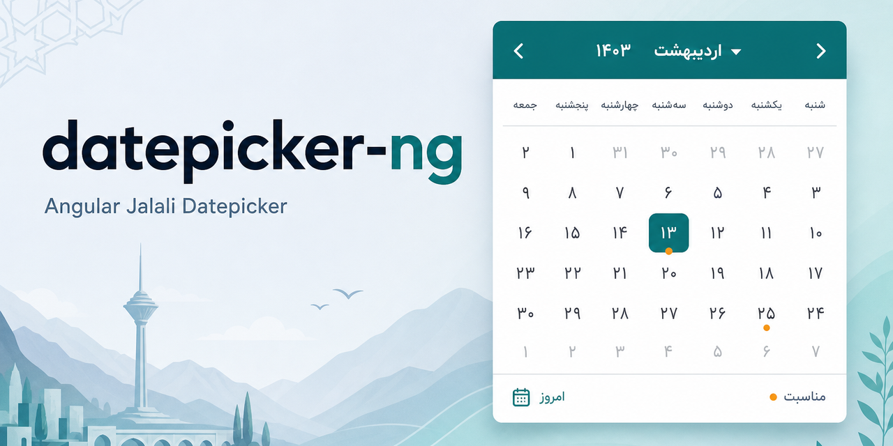

# datepicker-ng

<p align="center">
  
</p>

Angular Jalali (Persian / Shamsi) datepicker styled with **Tailwind CSS**. Supports **RTL** and **LTR**.

## Install

```bash
npm install datepicker-ng
```

### Peer dependencies

```bash
npm install @angular/core @angular/common @angular/forms @lucide/angular rxjs
```

Your app must use **Tailwind CSS v4** (or v3 with content scanning) and include this package in the scan path so utility classes used by the component are generated.

**Tailwind v4** (CSS-first):

```css
@import 'tailwindcss';
@source '../node_modules/datepicker-ng/**/*.{mjs,js}';
```

**Tailwind v3** (`tailwind.config.js`):

```js
module.exports = {
  content: [
    './src/**/*.{html,ts}',
    './node_modules/datepicker-ng/**/*.{mjs,js}',
  ],
  // ...
};
```

### Locale & translations

English labels apply automatically when `calendar="gregorian"` (unless you set `locale` / `translations`).

```ts
import { DATEPICKER_LOCALE_EN, DatepickerLocale } from 'datepicker-ng';

// Built-in
<datepicker-ng calendar="gregorian" locale="en" />

// Custom language (e.g. Arabic / German / …)
const ar: Partial<DatepickerLocale> = {
  select: 'اختيار',
  cancel: 'إلغاء',
  today: 'اليوم',
  clear: 'مسح',
  monthNames: [/* 12 names */],
  weekdaysMin: [/* 7 short names, Sunday-first */],
  weekStart: 6,
};

<datepicker-ng [translations]="ar" />

// Week starts Monday
<datepicker-ng calendar="gregorian" locale="en" [weekStart]="1" />
```

### Accent color

Override CSS variables on a parent or `:root`:

```css
:root {
  --dp-accent: #0d7377;
  --dp-on-accent: #ffffff; /* text on selected / accent — keep readable */
  --dp-surface: #ffffff;
  --dp-border: #c5d0de;
  --dp-text: #101828;
  --dp-muted: #5a6a7e;
  --dp-hover: #eef2f6;
}

.dark {
  --dp-accent: #2ec4b6;
  --dp-on-accent: #04201c;
  --dp-surface: #121a24;
  --dp-border: #243041;
  --dp-text: #e6edf5;
  --dp-muted: #8b9aab;
  --dp-hover: #1a2432;
}
```

Use `contrastingOnAccent(hex, 'light' | 'dark')` from `datepicker-ng` to pick a readable `--dp-on-accent` for any custom accent.

## Usage

`JalaliDatePicker` is a standalone component and implements `ControlValueAccessor`.

```ts
import { Component } from '@angular/core';
import { FormsModule } from '@angular/forms';
import { JalaliDatePicker } from 'datepicker-ng';

@Component({
  selector: 'app-demo',
  imports: [FormsModule, JalaliDatePicker],
  template: `
    <datepicker-ng [(ngModel)]="date" placeholder="انتخاب تاریخ" />
    <!-- LTR layout -->
    <datepicker-ng [(ngModel)]="date" dir="ltr" />
  `,
})
export class DemoComponent {
  date: Date | null = null;
}
```

### Date + time

```html
<!-- After choosing a date, the panel switches to the time picker -->
<datepicker-ng showTime timePickerType="digital" [(ngModel)]="date" />

<!-- Analog clock face -->
<datepicker-ng showTime timePickerType="analog" hourFormat="12" [(ngModel)]="date" />

<!-- Time only (no calendar) -->
<datepicker-ng timeOnly timePickerType="digital" [(ngModel)]="date" />

<!-- include seconds -->
<datepicker-ng showTime showSeconds [(ngModel)]="date" />
```

| Input | Description |
| --- | --- |
| `showTime` | After a date is selected, show the time step |
| `timeOnly` | Time picker only (no calendar) |
| `timePickerType` | `'digital'` (default) \| `'analog'` |
| `hourFormat` | `'24'` (default) \| `'12'` |
| `showSeconds` | Include seconds |

### Range selection

```html
<datepicker-ng [(ngModel)]="range" selectionMode="range" />
```

### Common inputs

| Input | Description |
| --- | --- |
| `dir` | `'rtl'` (default) \| `'ltr'` — layout, chevrons, arrow keys |
| `calendar` | `'jalali'` (default) \| `'gregorian'` — panel calendar system |
| `locale` | `'fa'` \| `'en'` \| custom locale object. Default: `fa` for Jalali, `en` for Gregorian |
| `translations` | `Partial<DatepickerLocale>` overrides (any language) |
| `weekStart` | `0`–`6` (Sun–Sat). Default from locale (`fa`→Sat, `en`→Sun) |
| `placeholder` | Input placeholder (falls back to locale) |
| `selectionMode` | `'single'` \| `'range'` |
| `inline` | Show calendar without overlay |
| `disabled` | Disable the control |
| `editable` | Allow typing in the input |
| `minDate` / `maxDate` | Bounds (`Date`) |
| `valueFormat` | `'date'` \| `'jalali'` \| `'custom'` |
| `inputCalendar` | `'jalali'` \| `'gregorian'` for typed input |
| `displayFormat` | e.g. `'jalali-short'`, `'jalali-slash'`, `'gregorian-slash'` |
| `showClear` | Show clear icon |
| `showTime` | After date pick, open the time step |
| `timeOnly` | Time picker only (no calendar) |
| `timePickerType` | `'digital'` \| `'analog'` |
| `hourFormat` | `'24'` (default) \| `'12'` |
| `showSeconds` | Include seconds when time is enabled |
| `autoCommit` | Commit selection immediately |
| `styleClass` | Extra classes on the root |

### Outputs

`onSelect`, `onClear`, `onInputInvalid`, `onShow`, `onHide`

## API exports

```ts
import {
  JalaliDatePicker,
  DatepickerNg, // alias of JalaliDatePicker
  DatepickerDir,
  JalaliDatePickerClasses,
  // calendar helpers
  toJalaliParts,
  toJalaliDateTimeParts,
  toGregorianDate,
  applyTimeToDate,
  parseJalaliDateString,
  formatJalaliDisplay,
  formatTimeDisplay,
} from 'datepicker-ng';
```

## Showcase

```bash
npm install
npm start
```

Opens the demo app at `http://localhost:4400`.

```bash
npm run build:showcase
```

## CI / Publish

- **CI** (`.github/workflows/ci.yml`) — on push/PR to `main`: install, test, build library, build showcase.
- **Pages** (`.github/workflows/pages.yml`) — on push to `main`: build showcase and deploy to GitHub Pages.
- **Publish** (`.github/workflows/publish.yml`) — on push to `main` when `package.json` changes: publishes to npm only if the version is new.

Live demo: [Hkarimi561.github.io/datepicker-ng](https://Hkarimi561.github.io/datepicker-ng/)

In the repo: **Settings → Pages → Source: GitHub Actions**.

### Publish setup (Trusted Publishing — no token)

Classic npm token types are gone. CI should use **Trusted Publishing** (OIDC), not a long-lived token.

1. Open https://www.npmjs.com/package/datepicker-ng → **Settings** → **Trusted Publisher**
2. Choose **GitHub Actions** and set:
   - Organization or user: `Hkarimi561`
   - Repository: `datepicker-ng`
   - Workflow filename: `publish.yml` (filename only)
   - Environment name: leave **empty** (unless you enable `environment:` in the workflow)
   - Allowed actions: enable **npm publish**
3. Save, then bump version and push (or re-run the workflow)

No `NPM_TOKEN` is required for publish when Trusted Publishing is configured.

#### If you still use a granular token

- When creating the token, enable **Bypass 2FA** (unchecked by default) or CI fails with `EOTP`.
- Put the secret under **Settings → Secrets and variables → Actions → Repository secrets** as `NPM_TOKEN`.
- Secrets under **Environments** are **not** visible unless the job has `environment: <that-name>`. Your publish job does not use an environment by default, so an Environment secret alone will not work.

To release: bump `"version"` in `package.json`, commit, and push to `main`. CI skips publish if that version already exists on npm.

Publish from the built package locally:

```bash
npm run publish:lib
```

## License

MIT
